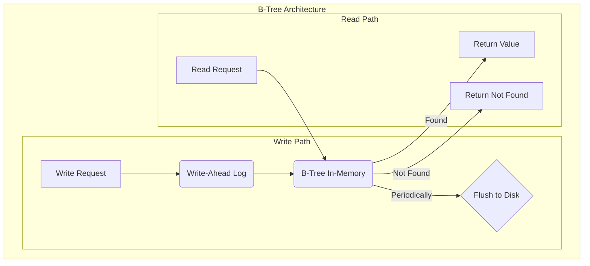
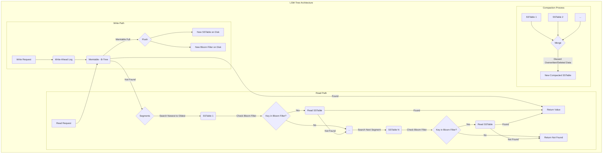

# Storage Engine

This project is a Python-based storage engine offering two distinct backend implementations: a B-Tree and a Log-Structured Merge-Tree (LSM-Tree). It's designed for educational purposes to illustrate concepts from the book "Designing Data-Intensive Applications."

## Features

- **Two Storage Engines**: Choose between a B-Tree for balanced performance and an LSM-Tree for write-heavy workloads.
- **ACID-compliant B-Tree**: The B-Tree engine ensures durability through a Write-Ahead Log (WAL).
- **Fuzzy Search**: The LSM-Tree engine supports fuzzy string searching using Levenshtein distance.
- **Pluggable Architecture**: Easily switch between storage engines.

## Architecture

The `DB` class provides a unified interface to two distinct storage engine architectures: a B-Tree and an LSM-Tree. While a database system is typically built on one of these structures, this project implements both for educational purposes. It's important to note that the `BTree` class has a dual role here: it serves as a complete, standalone B-Tree-based engine, and it is also used as the in-memory `memtable` component within the `LSMTree` engine.

### B-Tree Engine

The B-Tree engine is a self-balancing tree data structure that maintains sorted data and allows for efficient searches, insertions, and deletions. All modifications are written to a Write-Ahead Log (WAL) to ensure durability and crash recovery.

### LSM-Tree Engine

The LSM-Tree engine is optimized for write-heavy workloads. It consists of:

- **Memtable**: An in-memory B-Tree that buffers recent writes.
- **SSTables (Sorted String Tables)**: Immutable, on-disk files that store data sorted by key.
- **Bloom Filter**: A probabilistic data structure to quickly check for the existence of a key in an SSTable.
- **Compaction**: A background process that merges SSTables to remove duplicates and deleted entries.





## How to Use

### Installation

First, install `uv` if you don't have it yet. Then, create a virtual environment and install the dependencies:

```bash
# Create a virtual environment
uv venv

# Activate the environment
source .venv/bin/activate

# Install the project in editable mode with test dependencies
uv pip install -e ".[dev]"
```

### Basic Usage

The `DB` class provides a simple interface for `put`, `get`, and `delete` operations.

```python
from storage_engine.db import DB

# Initialize with the B-Tree engine (default)
db = DB(engine_type='btree')
db.put('hello', 'world')
print(db.get('hello'))  # Output: world
db.delete('hello')
print(db.get('hello'))  # Output: None

# Initialize with the LSM-Tree engine
db_lsm = DB(engine_type='lsmtree')
db_lsm.put('lsm', 'tree')
print(db_lsm.get('lsm'))  # Output: tree
```

### Fuzzy Search (LSM-Tree only)

The LSM-Tree engine supports fuzzy key searches.

```python
db_lsm.put('apple', 'fruit')
db_lsm.put('apply', 'action')
results = db_lsm.fuzzy_get('appel', 1)
print(results)  # Output: [('apple', 'fruit')]
```

## Running Tests

To run the test suite, use `pytest`:

```bash
pytest
```

## Components

- **`db.py`**: Provides the `DB` class, a unified interface to the storage engines.
- **`engine.py`**: Defines the abstract `StorageEngine` base class.
- **`btree.py`**: Implements the B-Tree storage engine with a Write-Ahead Log.
- **`lsmtree.py`**: Implements the Log-Structured Merge-Tree engine.
- **`wal.py`**: Implements the Write-Ahead Log for the B-Tree.
- **`sstable.py`**: Implements the Sorted String Table (SSTable) for the LSM-Tree.
- **`bloom_filter.py`**: Implements the Bloom Filter for efficient key lookups in SSTables.
- **`levensthein.py`**: Provides the Levenshtein distance calculation for fuzzy searches.
- **`heap.py`**: Implements a Min-Heap, used for the k-way merge in the LSM-Tree's compaction process.
- **`tests/`**: Contains the unit tests for the project.

This file provides the `SSTable` class, which represents the on-disk segment files. It includes methods for:

-   Writing a memtable to an SSTable file.
-   Creating and saving a bloom filter for the keys in the SSTable.
-   Reading data from an SSTable file, using the bloom filter to avoid unnecessary disk access.
-   Iterating over the key-value pairs in a file for the compaction process.

### `bloom_filter.py`

This file contains the `BloomFilter` class, a simple implementation of a bloom filter using a bit array and multiple hash functions.

### `levensthein.py`

This file provides an implementation of the Levenshtein distance algorithm. The `Levenshtein` class contains a static method `distance(s1, s2)` that calculates the number of single-character edits (insertions, deletions, or substitutions) required to change one string into another. This can be useful for features like fuzzy string searching.

## Usage

Here is a basic example of how to use the storage engine:

```python
from lsmtree import LSMTree
import shutil

# Initialize the storage engine
data_dir = 'my_database'
db = LSMTree(data_dir)

# Write some data
db.put("name", "Adrien")
db.put("city", "Paris")

# Read data
print(f"Name: {db.get('name')}")  # Output: Name: Adrien

# Overwrite data
db.put("name", "Adrien Schuler")
print(f"Name: {db.get('name')}")  # Output: Name: Adrien Schuler

# Delete data
db.delete("city")
print(f"City: {db.get('city')}")  # Output: City: None

# Close the database (flushes any remaining data in the memtable)
db.close()

# Clean up the data directory
shutil.rmtree(data_dir)
```

## Running Tests

The `tests` directory contains a suite of unit tests to verify the functionality of the storage engine.

### Running All Tests

To run all tests, you can use the following command from the root of the project. This will discover and run all test files in the `storage_engine/tests` directory:

```bash
pytest storage_engine/tests
```

### Running a Specific Test File

If you want to run a specific test file, you can do so by specifying the path to the file:

```bash
pytest storage_engine/tests/test_lsmtree.py
```

## Testing

The `test_lsmtree.py` file contains a suite of unit tests to verify the functionality of the storage engine, including puts, gets, overwrites, deletions, persistence, and compaction. It also includes a performance benchmark test (`test_performance_benchmark`) that demonstrates the effectiveness of the bloom filter by comparing the lookup times for existing versus non-existing keys.
